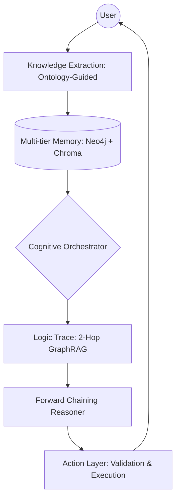

# 🧠 Clawra: Kinetic Ontology-Driven Cognitive Engine

[](https://github.com/wu-xiaochen/AbilityBuilder-Agent/stargazers)
[](https://github.com/wu-xiaochen/AbilityBuilder-Agent/blob/main/LICENSE)
[](https://www.python.org/)

**Clawra** is a production-grade, neuro-symbolic framework for autonomous agents inspired by **Palantir Foundry’s Ontology**. It transforms static knowledge into a **Kinetic Decision-Making System** through formal RDF/OWL logic, high-fidelity GraphRAG, and verifiable reasoning traces.

---

## 🏗️ Architecture: From Description to Action

Clawra separates the world into three distinct layers, ensuring that LLM reasoning is grounded in verifiable organizational logic:
1.  **Object/Link Layer**: Entities and their relationships (The "What").
2.  **Logic Layer (Reasoning)**: Formal OWL rules and forward-chaining inference (The "Why").
3.  **Action Layer (Kinetic)**: Operational verbs that perform validations and drive decisions (The "How").



# 🧠 Clawra 神经符号人工智能平台 (Neuro-Symbolic Cognitive Engine)

## 📌 项目定位

**Clawra Cognitive Engine** 现已正式跨越“知识检索”的古典 RAG 时代，进化成为基于 **神经符号计算 (Neuro-Symbolic V-RAG)** 与 **粒度理论 (Grain Theory)** 的企业级推理中枢平台。

它是为真正的商业智能体 (Business Agents) 打造的“大脑底座”：
1. 它不再迷信大模型的计算能力，而是将大模型作为**语言解析中枢**。
2. 核心数学和业务边界由本地的 **RuleEngine 沙盒** 与 **Ontology 本体图数据库** 执掌。
3. 具备自主学习与遗忘代谢机制：过时的隐性知识会被 `MemoryGovernor` 自动剪枝降权。

## ✨ 企业级核心架构特征 (v3.5 Kinetic Edition)

### 1. 深度治理的图向量混合记忆 (Hybrid Governed Memory)
- **Semantic Layer**: 基于 `ChromaDB` (长文本向量引擎) + `Neo4j` (动态关系图谱) 实现双重语义召回。
- **Governance Layer**: 引入时间片遗忘与置信度衰减算法 (`governance.py`)。大模型如果引用了某种错误或冲突经验，导致规则回滚，该知识的三元组权重会直接扣减，当 Confidence < 0.20 时自动发生**神经元突触剪枝 (Synaptic Pruning)**。

### 2. 绝对免疫“人工智能数学幻觉” (Rule-Gated Math Sandbox)
完全剥夺大模型的算术能力！我们在 `src/core/ontology/rule_engine.py` 中实现了纯净的 AST 解析沙盒环境。当遇到如“所需资金不得超过预算115%”或“安全供气余量必须>70%”时，大模型只负责将所需变量抽出丢入引擎，最终真假由沙盒判定输出（完全规避 GPT 做错大小对比/幻觉的灾难）。

### 3. 三位一体的动力学闭环 (Tri-Layer Action Linkage)
系统脱离了被动检索，升级为**“能动执行”**。
- `Action Registry` 将纯后端的 API 物理动作与 Graph 实体强绑定。
- 在 Action 被执行前，触发 **Pre-Condition Rule Gating (规则门控)**。本体引擎会自动拉取挂载在该实体上的所有 Rule 进行数学审计。违规者立即生成高能警戒级 **审计拦截 (BLOCKED)** 历史记录，斩断失控风险。

### 4. 高保真白盒化推理追踪 (High-Fidelity Transparent Tracing)
所有黑盒运作（如 LLM 本身的思考过程 Chain-Of-Thought、沙盒执行参数、粒度审计、图谱展开路径）全量记录。不仅向开发者输出详细的 JSON Schema Trace Payload，并通过 Demo 进行可视化呈现，企业客户可以完美审查每一步机器行动的逻辑和依据。

---

## 🚀 Quick Start

### 1. Prerequisites
- Python 3.10+
- OpenAI API Key
- Neo4j (Optional, defaults to in-memory mode if not found)

### 2. Setup
```bash
git clone https://github.com/wu-xiaochen/AbilityBuilder-Agent.git
cd AbilityBuilder-Agent
pip install -r requirements.txt
```

### 3. Launch the Professional Console
```bash
streamlit run examples/streamlit_app.py
```

---

## 🛠️ Project Structure

-   `src/`: **Framework Core**. Decoupled modules for Reasoner, Memory, Perception, and Evolution.
-   `examples/`: **Production Interface**. The high-fidelity Streamlit console.
-   `docs/`: **Knowledge Base**. Architecture deep-dives and conceptual guides.
-   `tests/`: **Rigorous Validation**. Comprehensive test suite (15+ core integration tests).

---

## 📄 License

Clawra is licensed under the MIT License. Built with ❤️ for the future of **Autonomous Cognitive Intelligence**.
