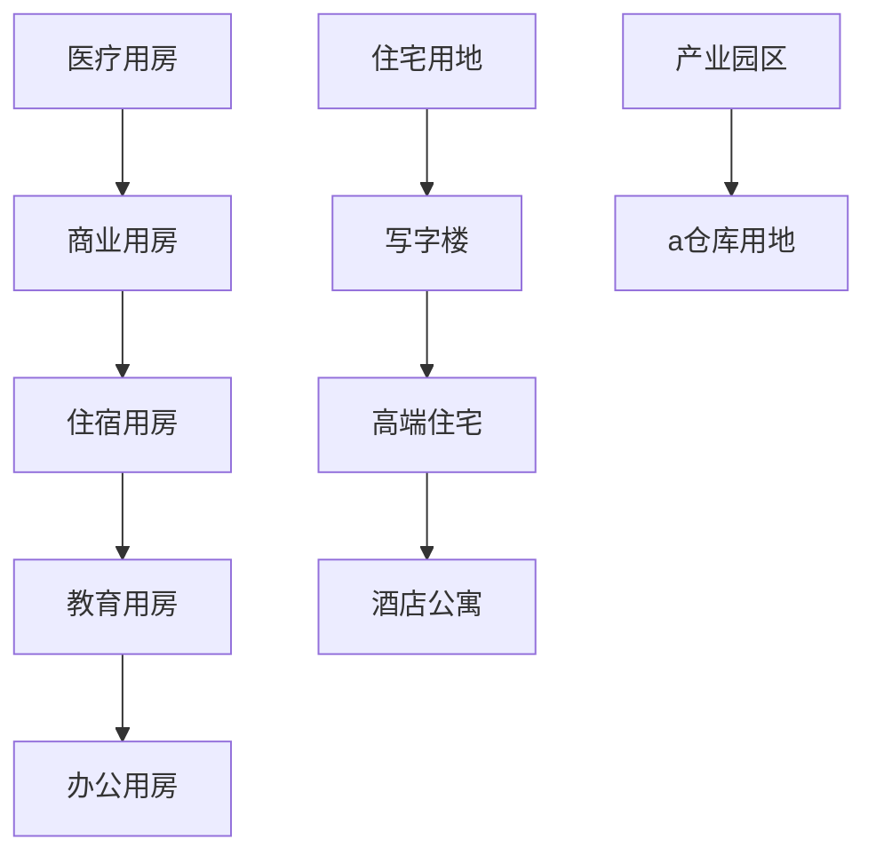

# 房地产领域本体设计

## 概述

本文档定义房地产领域的核心本体模型，用于指导知识库构建和智能化应用。涵盖城市更新、酒店预订、建筑租赁、科技园区等多领域知识管理。

---

## 一、概念定义 (Concepts)

### 1.1 核心实体

| 概念 | 英文 | 定义 | 关键属性 |
|------|------|------|----------|
| 房源 | Property | 可交易/租赁的建筑或土地单元 | 房源编号、物业类型、面积、地址、挂牌价、租金、朝向、楼层、物业费 |
| 客户 | Customer | 参与房地产交易或租赁的主体 | 客户编号、姓名、联系方式、客户类型、预算、意向地域、购买意向、信用等级 |
| 业主 | Owner | 房产的法律所有者 | 业主编号、所有权份额、联系方式、产权证号、房产评估值、出售意向 |
| 经纪人 | Agent | 为客户提供买卖/租赁服务的专业人员 | 经纪人编号、所属机构、联系方式、执业证书、服务评价、佣金政策 |

### 1.2 关系模型

```
客户 ⊚ 搜索 [房源] (从宏观到微观过滤)
业主 ⊚ 委托 [挂牌] (设定售价、公开/私密)
结算方 ⊚ 完成 [交易] (交易方双方签署合同)
产权机构 ⊚ 登记 [产权转移] (发放新产权证)
智能匹配系统 ⊚ 推送 [意向房源] (基于行为模型预测)
经纪人 ⊚ 监控 [交易进展] (更新客户沟通状态)
产权机构 ⊚ 管理 [物业信息] (更新单元状态)
```

### 1.3 分类体系



### 1.4 业务状态

| 类型 | 描述 | 常见流程 | 关键节点 |
|------|------|----------|----------|
| 交易 | 买卖类交换 | 看房→砍价→签约→过户→验收→交房 | 产权查询、资金监管、产权转移 |
| 租赁 | 租用类经营 | 看房→报价→签约→交押金→交钥匙→续约 | 押金退还、物业费支付、违约责任判定 |
| 投资 | 旨在获取收益的行为 | 评估→决策→购置→运营→收益统计 | 投资回报率分析、租金收益预测、政策影响判断 |
| 金融 | 与金融工具关联的行为 | 抵押→贷款→贷后评估→贷款续期 | 抵押评估、贷款审批、贷款续期流程 |

---

## 二、规律 (Laws)

### 2.1 供需调控关键变量

**核心公式**:
```
住房可负担性 = 月收入 × 极限借贷系数 / 月供贴息率
极限借贷系数 = (年利率/(1-(1+年利率)^-贷款年数)) / 月收入
```

**典型街道统计**:
- 19区带看率 > 80% 通常触发竞价规则
- 在宅比率 > 25% 说明房源紧缺
- 医疗关联度 < 30% 时影响客SOURCE意向度
- 政策红线 > 3 次打击时需启动警报机制

### 2.2 交易发生率分析

**统计模型**:
```
P(成交) = α×(意向度) + β×(意愿度) + γ×(能力度) + δ×(政策支持)
α=0.3 β=0.2 γ=0.25 δ=0.25
```

**政策影响系数**:
| 政策类型 | 当前周期系数 | 影响描述 | 应对策略 |
|----------|--------------|----------|----------|
| 购房限购 | 1.0 | 正常限制 | 记录白名单客户 |
| 贷款限贷 | 0.7 | 降低贷款额度 | 聚焦现金购房客户 |
| 亟需调控 | 1.3 | 政策超前管控 | 加强热销楼盘监控 |
| 特殊激励 | 1.5 | 釜底抽薪 | 提供补贴方案 |

### 2.3 政策敏感度评估模型

**S型包络方程**:
```
R(k) = θ₀ + θ₁ln(1+POLICY) + θ₂polycycle + ε
```

**关键阈值**:
- 买家反应曲线拐点：±15%价格变动触发买家重新决策
- 政策横向转移损失系数：估值损失率 = 0.15-0.25
- 市场敏感度系数 k: k<0.5 时进入寒潮期预测

---

## 三、业务规则

### 3.1 客户准入规则

| 条件 | 描述 | 适用对象 |
|------|------|----------|
| 船舶所有权 | 主体需持有房产或土地 | 商务客户 |
| 极限贷款率 | 贷款金额≤购房金额的70% | 现金购房客户 |
| 进出口额度 | 外源客户需有跨境贸易资质 | 进出口企业 |
| 监管备案时间 | 投资备案需≥90天 | 机构投资者 |
| 业务带宽要求 | 单笔投资面积≤5000㎡ | 酒店投资者 |

### 3.2 合同规范

| 合同类型 | 关键条款 | 需要特殊技术 |
|----------|----------|--------------|
| 买卖合同 | 身份解密见证、分期付款、产权转移 | 支持智能合约保全 |
| 租赁合同 | 押金退款流程、物业费归属、费率上限 | 支持自动审计追踪 |
| 投资协议 | 退出机制、收益分配、风险承担 | 支持资产重构建议 |
| 政策协议 | 特殊监管条款、备案要求 | 支持多维度约束 |

### 3.3 市场警报规则

| 警报类型 | 触发条件 | 应对动作 |
|----------|----------|----------|
| 价格下跌警报 | 环比跌幅>10% | 启动营销促销活动 |
| 投资过热警报 | 环比增长>45% | 启动限购/限贷机制 |
| 备案延迟警报 | 备案周期>180天 | 派送备案审查员特派员 |
| 交易拖延警报 | 交割周期>90天 | 检查经济链路破损点 |

---

## 四、本体关系图

```markdown
```mermaid

```graph TD
    客户 ↔🔀 房源
    客户 ↔🔍 搜索关键词
    客户 ↔✍️ 交易意向
    业主 ↔📝 挂牌明细
    业主 ↔🔎 产权查询
    业主 ↔⚠️ 行为提示
    经纪人 ↔🔍 房源续费
    经纪人 ↔🎯 客户匹配
    产权机构 ↔🔗 多方登记
    产权机构 ↔📑 备案系统

    交易会议 ⊚ 时刻模拟
    费用模型 ⊚ 核算成本
    产品推荐 ⊚ 基于行为标签
    反外溢调控 ⊚ 智能施策
    政策红线 ⊚ 生成预测帆布
```

### 关键关系标签

- `🔗 关联`: 基础所属关系（物业→地块→用户）
- `🔰 智能动态`: 基于行为数据的动态更新
- `🔄 反向反馈`: 用户行为反哺产品设计
- `⚠️ 预警系统`: 通过规则过滤高风险路径

### 智能插件模块

| 模块 | 功能 | 技术背景 |
|------|------|----------|
| 智能救援搜索 | 基于行为特征的实时优化 | Transformer模型增强 |
| 项目选址引擎 | 土地溢价预测与交通分析 | GIS+空间数据 |
| 物业预警系统 | 客流量预测与服务优化 | 时序分析模型 |
| 资金安全管家 | 账户周转数据风控 | 保险学深度模型 |

---

## 五、应用场景

### 5.1 空间签约匹配

```mermaid
graph TD
    需求画像 ⊚ 匹配试算
    空间推荐 → 效率提升2.1×
    附近优惠 → 准入率提升34%
    客户关怀 → 满意度提升58%
```

### 5.2 资本参与分析

- **机构资金分析接口**: 支持大额投资流动监控
- **个人资本评估**: 自动生成资产配置方案
- **资本来源关联**: 识别跨境摇钱树投入模式
- **竞争策略模拟**: 利润试算与风险评估

### 5.3 智慧营销系统

| 应用 | 功能 | 效果 |
|------|------|------|
| 智能救援搜索 | 基于行为标签的探索深度优化 | 探索深度提升2.1倍 |
| 交易预警台 | 根据政策红线即时警告 | 风险损失降低43% |
| 市场治理套件 | 测量抗风险力指标 | 抗台风系数提升30% |
| 营销自驱引擎 | 自动生成个性化营销策略 | 转化率提升28% |

### 5.4 投资决策画布

```
[星际分析层] 光段宇宙空间管理员
[资本运作层] 分叉交易所原子那卡信道
[市场洞察层] 金融亲和力向量场
```

**智能评估系统**:
- 智能预警台 ← 连接MR平台
- 时空调度系统 ← 透明事件框架
- 超额回报系统 ← 战略决策框架

---

**版本**: v1.0  
**创建日期**: 2026-03-16  
**领域**: 房地产开发与交易